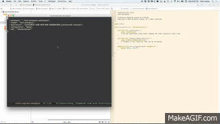

[](http://melpa.org/#/xcode-mode)
[](https://travis-ci.org/nicklanasa/xcode-mode)

# xcode-mode

**xcode-mode** is a minor mode for Emacs to perform `xcodebuild` actions in your Xcode projects.

**Note**: `xcode-mode` uses `ios-sim` and `xctool`, `xctool` will use a **.xctool-args** file in the root project directory to execute commands.



## Installation

Requires
* [xctool](https://github.com/facebook/xctool)
* [ios-sim](https://github.com/facebook/xctool)

```
(use-package xcode-mode :ensure t)
```

## Manual Installation

```
git clone https://github.com/nicklanasa/xcode-mode.git
```

## Usage

```
(require 'xcode-mode)
(xcode-mode 1)
```

## Hydra (Popup window with command list)

* `C-M-x h` opens the hydra command list popup.

Can also be customized by creating your own bindings

```
(global-set-key (kbd "s-l") 'xcode-launcher/body)
```

## Keybindings

All keybindings start with `C-M-x`. All functions in xcode-mode have a two-letter mnemonic shortcut, for instance, to build a project with a `.xctool-args` file in it's root directory you would do `C-M-x bb`.

Here are all the keybindings:

* `C-M-x rr` runs a project or workspace based on **.xctool-args** on a device based on the `xcode-ios-sim-devicetype` xcode-mode var. Set this to tell xcode-mode what device you want to run the app on. Defaults to `com.apple.CoreSimulator.SimDeviceType.iPhone-6, 9.1`
* `C-M-x bb` builds project or workspace based on **.xctool-args**.
* `C-M-x rt` executes the `run-tests` command via `xctool`.
* `C-M-x bt` executes the `build-tests` command via `xctool`.
* `C-M-x cc` cleans the project.
* `C-M-x tt` test project or workspace based on **.xctool-args**.
* `C-M-x aa` archives project or workspace based on **.xctool-args**.
* `C-M-x pi` runs `pod install`.
* `C-M-x os` displays a list of Storyboard's to open in the current directory.
* `C-M-x ow` opens a workspace file in Xcode in the current directory.
* `C-M-x op` opens a project file in Xcode in the current directory.
* `C-M-x dd` displays a list of derived data folders to delete.

## Misc

### Change default simulator

Simulator types

```
com.apple.CoreSimulator.SimDeviceType.iPhone-4s, 9.2
com.apple.CoreSimulator.SimDeviceType.iPhone-5, 9.2
com.apple.CoreSimulator.SimDeviceType.iPhone-5s, 9.2
com.apple.CoreSimulator.SimDeviceType.iPhone-6, 9.2
com.apple.CoreSimulator.SimDeviceType.iPhone-6-Plus, 9.2
com.apple.CoreSimulator.SimDeviceType.iPhone-6s, 9.2
com.apple.CoreSimulator.SimDeviceType.iPhone-6s-Plus, 9.2
com.apple.CoreSimulator.SimDeviceType.iPad-2, 9.2
com.apple.CoreSimulator.SimDeviceType.iPad-Retina, 9.2
com.apple.CoreSimulator.SimDeviceType.iPad-Air, 9.2
com.apple.CoreSimulator.SimDeviceType.iPad-Air-2, 9.2
com.apple.CoreSimulator.SimDeviceType.iPad-Pro, 9.2
com.apple.CoreSimulator.SimDeviceType.Apple-TV-1080p, 9.1
com.apple.CoreSimulator.SimDeviceType.Apple-Watch-38mm, 2.1
com.apple.CoreSimulator.SimDeviceType.Apple-Watch-42mm, 2.1
```

`(defvar xcode-ios-sim-devicetype "com.apple.CoreSimulator.SimDeviceType.iPhone-6, 9.1")`

### Example custom `completing-read` function to change user interaction.

`(setq xcode-completing-read-function 'ivy-completing-read)`

## Contribute

Yes, please do. Tests are setup but none are written, would love some help here as well.

You'll find the repo at:

```
https://github.com/nicklanasa/xcode-mode.git
```

To fetch the test dependencies, install
[cask](https://github.com/rejeep/cask.el) if you haven't already,
then:

```
$ cd /path/to/xcode-mode
$ cask
```

Run the tests with:
```
$ ./run-tests.sh
```

## License

Copyright (C) 2015 Nickolas S Lanasa III

Author: Nickolas S Lanasa III <nick@nytekproductions.com>
Keywords: Xcode, iOS

This program is free software; you can redistribute it and/or modify
it under the terms of the GNU General Public License as published by
the Free Software Foundation, either version 3 of the License, or
(at your option) any later version.

This program is distributed in the hope that it will be useful,
but WITHOUT ANY WARRANTY; without even the implied warranty of
MERCHANTABILITY or FITNESS FOR A PARTICULAR PURPOSE.  See the
GNU General Public License for more details.

You should have received a copy of the GNU General Public License
along with this program.  If not, see <http://www.gnu.org/licenses/>.
